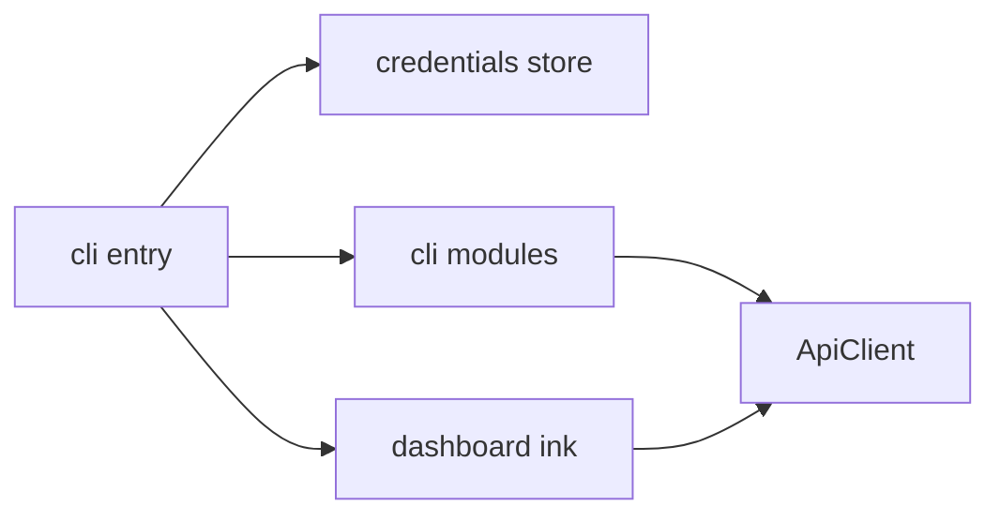

# Rust CLI → npm (TypeScript rewrite)

## Reality check on “fast”

This repo is ~2k lines of Rust across [`src/api`](src/api), [`src/config/store.rs`](src/config/store.rs), nine command modules under [`src/cli`](src/cli), utilities, and a ~365-line Ratatui dashboard in [`src/tui/dashboard.rs`](src/tui/dashboard.rs). A faithful TS port is **mechanical but multi-day** work; the fastest approach is a **line-by-line structural port** (same modules and endpoints), not a redesign.

## Recommended stack (matches current behavior)

| Concern | Rust today | TS choice |
|--------|------------|-----------|
| CLI routing | clap derive | [commander](https://github.com/tj/commander.js) (nested `.command()` mirrors subcommands) |
| HTTP | reqwest | Native `fetch` (Node **20+**) + small wrapper for timeout/headers/errors |
| JSON / types | serde | TypeScript interfaces + `JSON.parse` (port shapes from [`src/api/models.rs`](src/api/models.rs)) |
| Tables | tabled | [cli-table3](https://github.com/cli-table/cli-table3) |
| Colors / spinners | colored / indicatif | [chalk](https://github.com/chalk/chalk) / [ora](https://github.com/sindresorhus/ora) |
| `.env` | dotenvy | [dotenv](https://github.com/motdotla/dotenv) at process start (same as [`src/main.rs`](src/main.rs)) |
| Credentials file | `~/.flexprice/credentials.json` | `fs`, `os.homedir()`, same path logic as [`src/config/store.rs`](src/config/store.rs) |
| TUI | ratatui | [ink](https://github.com/vadimdemedes/ink) (+ `react`) for the dashboard—largest rewrite chunk |
| Build / bin | cargo | `typescript` + [tsup](https://github.com/egoist/tsup) (or `ts-node` for dev); `"bin": { "flexprice": "./dist/cli.js" }` with shebang |

**Node engine:** set `"engines": { "node": ">=20" }` so you can rely on global `fetch` and avoid extra HTTP clients.

## Monorepo layout: TypeScript under `npm/`

All Node tooling and source live in a **new directory** [`npm/`](npm/) at the repository root. The existing Rust project (`Cargo.toml`, `src/*.rs`) stays where it is until you deliberately remove it after parity. Benefits: clear separation, publish from `npm/` (`cd npm && npm publish`), and no collision between Rust’s `src/` and the TS `src/`.

Typical contents:

- [`npm/package.json`](npm/package.json) — package name, `bin`, dependencies, scripts
- [`npm/tsconfig.json`](npm/tsconfig.json) — compiler options (NodeNext or ES2022 + moduleResolution as appropriate)
- [`npm/tsup.config.ts`](npm/tsup.config.ts) — bundle entry → `dist/cli.js`
- [`npm/src/...`](npm/src/) — TypeScript sources described below
- Optional: [`npm/README.md`](npm/README.md) — install/publish notes for npm consumers

## Repository layout (parallel to Rust)

Paths below are under **`npm/`**. Keep module names so porting is obvious:

- `npm/src/api/client.ts` — port [`src/api/client.rs`](src/api/client.rs) (GET/POST/PUT/DELETE, auth headers, `x-environment-id`, error body parsing, `health_check`).
- `npm/src/api/models.ts` — port [`src/api/models.rs`](src/api/models.rs) (list wrappers + entity types).
- `npm/src/config/store.ts` — port [`src/config/store.rs`](src/config/store.rs) **exactly**: base from file (or defaults) → overlay `FLEXPRICE_*` env → overlay CLI `--api-url` / `--api-key`; same `masked_api_key` / `get_auth_header` (`x-api-key`).
- `npm/src/cli/*.ts` — one file per existing module ([`auth.rs`](src/cli/auth.rs), [`customers.rs`](src/cli/customers.rs), …); same flags and behavior (`--json`, file reads for `--json path`, PDF writes for invoices, etc.).
- `npm/src/utils/output.ts`, `npm/src/utils/spinner.ts` — port [`src/utils`](src/utils).
- `npm/src/tui/dashboard.tsx` — port [`src/tui/dashboard.rs`](src/tui/dashboard.rs) + theme from [`src/tui/theme.rs`](src/tui/theme.rs); wire `flexprice dashboard` to `ink` render.
- `npm/src/cli.ts` or `npm/src/main.ts` — port command enum + global options from [`src/main.rs`](src/main.rs).

## Implementation order (minimizes blocked work)

1. **Tooling** — Create [`npm/`](npm/) and add [`npm/package.json`](npm/package.json): `commander`, `chalk`, `ora`, `cli-table3`, `dotenv`, `typescript`, `tsup`, optional `ink` + `react` + `@types/react`; `npm run build` (from `npm/`) outputs `dist/cli.js`; `dev` uses `tsx watch`. Document in root README: `cd npm && npm install && npm run build`.
2. **Config + API client** — Prove auth and `health_check` against the real API before duplicating commands.
3. **Auth + config command** — Same UX as Rust (`set-api-key`, `status`, `whoami`, `logout`, `flexprice config`).
4. **Mechanical command ports** — For each [`src/cli/*.rs`](src/cli), copy HTTP paths and response handling verbatim; keep table columns and `--json` parity with [`src/utils/output.rs`](src/utils/output.rs).
5. **Dashboard last** — Once list/get flows work, rebuild panels in Ink (keyboard handling differs from Ratatui; map Tab/ arrows / r / q to ink keys).
6. **Cutover** — Remove [`Cargo.toml`](Cargo.toml) and Rust `src/**/*.rs` when behavior matches; update root [`README.md`](README.md) to primary-install via the `npm/` package (`npm i -g` from published tarball or `npm i -g ./npm` for local). Reserve npm name early (e.g. `@flexprice/cli` if `flexprice` is taken).

## Verification

- Run the same examples from [`README.md`](README.md) (create customer, ingest event, PDF download, `dashboard`).
- Spot-check credential precedence and global `--api-url` / `--api-key` against current Rust binary on the same machine.

## Risks / decisions

- **Ink vs blessed**: Ink is the most common Ratatui analogue in Node; it adds React bundling complexity—account for that in `tsup` config (bundle `dashboard` entry or mark `react`/`ink` externals correctly).
- **Binary distribution**: npm ships JS; startup is slower than Rust. If that matters later, you can add a separate optional native binary package—out of scope for a pure rewrite.
